# ***Chromlins* Postmortem**

The Making of [*Chromlins*](https://js13kgames.com/games/chromlins), an Augmented Reality game in less than 13KB created for the [JS13K 2026 Game Jam, in the WebXR category](https://js13kgames.com/2026/webxr). This year's theme was "Unicorns and Rainbows"

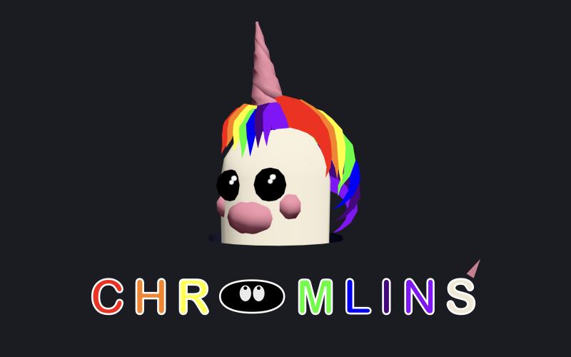

**TL;DR: Here is a trailer of the finished game in action:**

# Motivation

## Bio

Augmented Reality (AR) has been my passion and job for over 25 years. And as a long-time gamer, I have always dreamed of making a full game myself, even a small and casual one.

Besides my main activity as an XR research engineering manager, I also enjoy teaching [WebGL](https://fdoganis.github.io/slides/web3d_projects_20260211.html#16), [THREE.js](https://fdoganis.github.io/slides/web3d_projects_20260211.html#90) and [WebXR](https://fdoganis.github.io/slides/ar_projects_20260222.html#11) to future engineers. For the final project of my course I usually ask my students to create a small mobile AR game.

Last year, one student asked me candidly "how about you, have you ever created a game?". I paused, thoughtfully. I had made many internal professional projects, as well as a small public "serious game prototype" called [Pyromap](https://github.com/fdoganis/pyromap), with a team of young students, to help teach how to use a fire extinguisher. But a "real" game? Never.

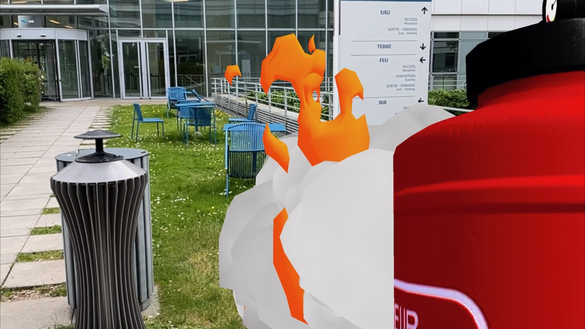

## JS13K

Therefore, when I learned about [JS13K](https://en.wikipedia.org/wiki/Js13kGames), and discovered all the amazing games produced over the years, I came to think that it would be the ideal jam format for me. It raises the bar from a technical point of view, since there is no room for too much sloppy code, and it encourages procedural asset generation, keeping me from tweaking assets forever or from being judged on artistic skills alone (I do love [drawing, sketching, painting](https://objkt.com/tokens/hicetnunc/41687) and [designing logos](https://js13kgames.com/2025/games/clawz), but that's another story altogether). 

Moreover, I really like the frugal aspect of JS13K, and the power of the web: no installation, no distribution, just send a link to anyone and they can start playing. 

In the past JS13K events, I didn't see any AR game (if I missed your wonderful hidden AR gem please correct me and let me play it!). So that would definitely be something new!

Last year, for my first entry ever, CLAWZ, I clearly understimated the amount of polish required to ship a proper game (my entry's logo might be nice, but I should have spent more time working on the game instead of playing with Inkscape). The game ended up 13th (out of 13...) but that was probably the best way to start JS13K! Maybe one day I'll finish it properly with all the features that I had in mind.

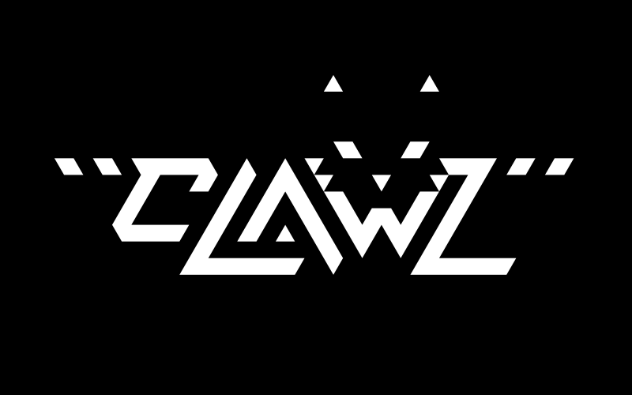

## Goals

Given my background, I wanted to create **a game that uses the real world**. I also wanted to make players move, use their body to play, and give them agency. 

But I also know that [cognitive overload can be a real issue in XR](https://www.frontiersin.org/journals/virtual-reality/articles/10.3389/frvir.2026.1874509/full). Many users struggle to adjust to novel immersive interaction paradigms, so **the experience needs to be kept as simple as possible**. But also fun (it's a game!), and original: I'm a researcher at heart, I don't enjoy cloning something that already exists as much as combining ideas and imagining new ways to **combine real and virtual worlds**.

# The original idea

## Prior Art

While I was looking for the most original existing AR games that put the real world into good use, I discovered two brilliant concepts : [Beatable](https://www.meta.com/experiences/beatable/9013855882035562/) on Meta , and [Fruit Defense](https://80.lv/articles/protect-real-apple-from-virtual-bugs-in-this-fun-ar-game-for-snapchat-spectacles) on Snap Spectacles.

  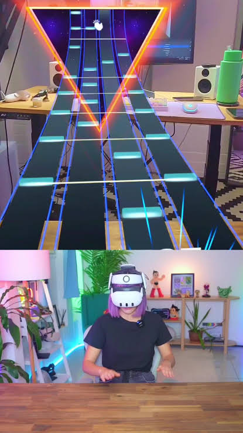

 

  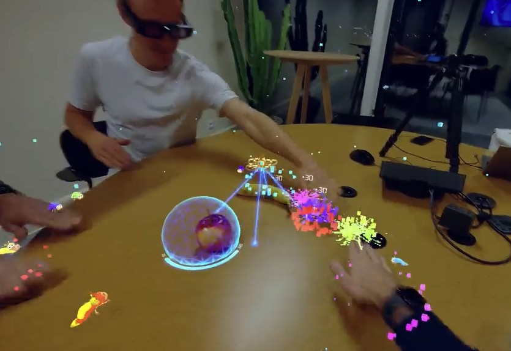

 

How could I draw inspiration from these gems, which use a physical table as a tangible gameplay element, to create a simple and fun game, but not a clone, in 13K?

## Early Feedback

I wrote down many potential game ideas, but after asking around me, the feedback that received was unanimous: the "whack-a-mole" game would be the most fun to play.

Indeed there are no complex rules, everyone gets it. It's super simple: you just hit targets, and as a bonus you can even feel the table to make interactions more tangible and increase the sense of presence. The game is casual, time limited, and familiar, it has an existing real counterpart, like the games you play in arcades and fairs.

 

 

So, let's build an AR whack-a-mole game!

# Software Engineering

## TypeScript

I want to hate TypeScript: it seems to introduce an ever growing number of concepts and incompatibilities with every release, and tries to divert JavaScript from its original intent, as the main native language of the Web. But I have been avoiding it for too long. 

If you're doing serious web development, you should give it a try: compile time type checking, automatic  documentation and autocompletion are priceless, but so are less known features it allows, like advanced tree-shaling Dead Code Elimination (DCE), as we'll see later.

 

I can't look back, but I still want to use as little TypeScript as possible, and I am ready to switch back to vanilla JS if it ever supports types. This year I discovered that I could configure my build pipeline to enforce the use of `erasableSyntaxOnly`. Quoting  the documentation "*it must be possible to easily erase any TypeScript-specific syntax from a file, leaving behind a valid JavaScript file.*"

Maybe I'm fooling myself, but I believe that this should make TypeScript impact as minimal as possible, using it mostly for types.

## 3D Library

In the WebXR category your game still needs to weigh only 13KB zipped, but you can use one of the proposed libraries for free! This year you could choose from [A-Frame](https://github.com/aframevr/aframe/releases/tag/v1.8.0), [Babylon.js](https://github.com/BabylonJS/Babylon.js/releases/tag/9.20.0), [PlayCanvas](https://github.com/playcanvas/engine/releases/tag/v2.21.3) and [THREE.js](https://github.com/mrdoob/three.js/releases/tag/r185).

There have been many advances in most of these 3D libraries, but I know THREE.js better than all the alternatives, I know its quirks, and there are many examples to draw inspiration from. Here's a mesmerizing example, [Chill the Lion](https://moments.epic.net/#lion), made using THREE.js by the amazing [Karim Maaloul](https://yakudoo.com):

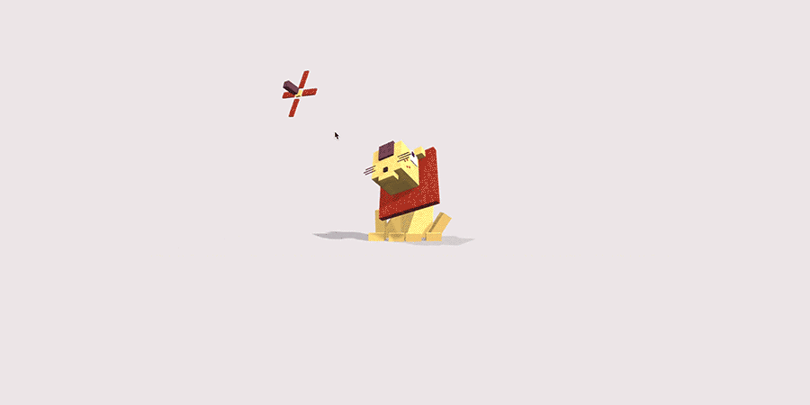

I'd love to use A-Frame in the future, since it comes with many XR featrues already baked in, but I feel, probably wrongly, that I'll need to spend a lot of time fitting existing code as well as original THREE.js code into components. Besides, I also want to try and create my own architecture.

## Architecture

I love software architecture as well as working with constraints to create **clean modular components**. But when I code for fun I tend to forget about software design altogether and focus on the goal.

That didn't end up well in [my previous JS13K attempt](https://js13kgames.com/2025/games/clawz): almost all the code was inside a unique file that got messier with each iteration. Adding features and bug fixes under time pressure just made things worse: the code was not manageable, and I wasted precious hours fighting the mess instead of polishing the game, which runs, but is no fun at all given all the missing functionality.

Surely there should be a way to keep design as cleanly as possible while keeping byte count low.

I decided to start with the best design practices that I could find: [Game Programming Patterns](https://www.gameprogrammingpatterns.com) was very inspiring for the core of my code. GameLoop, Input, States, are all essential! [Refactoring Guru](https://refactoring.guru/design-patterns) was interesting too, as a more readable alternative to the original [Design Patterns Book](https://en.wikipedia.org/wiki/Design_Patterns), which is still a reference today, despite its age and writing style.

Here's a very early UML diagram of the overall architecture of the game.

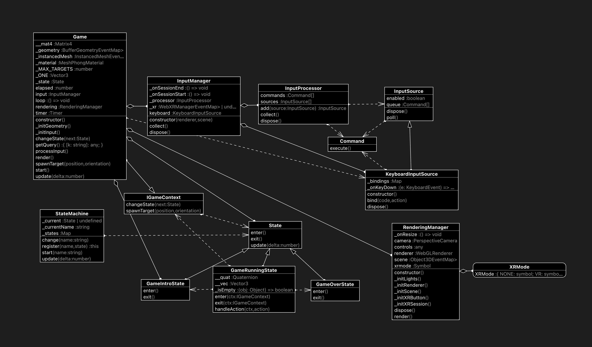

## Cross-Platform

I also wanted a game that would degrade gracefully, so that it would be **playable on most devices**. I'm glad that I made such a decision. 

Indeed, the main game is meant to be played in a see-through AR headset with your bare hands. 

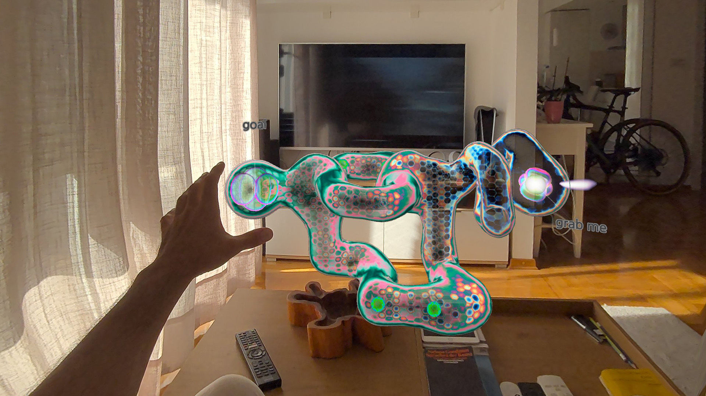

The second, more casual and more popular target might be the WebXR AR mobile mode. 

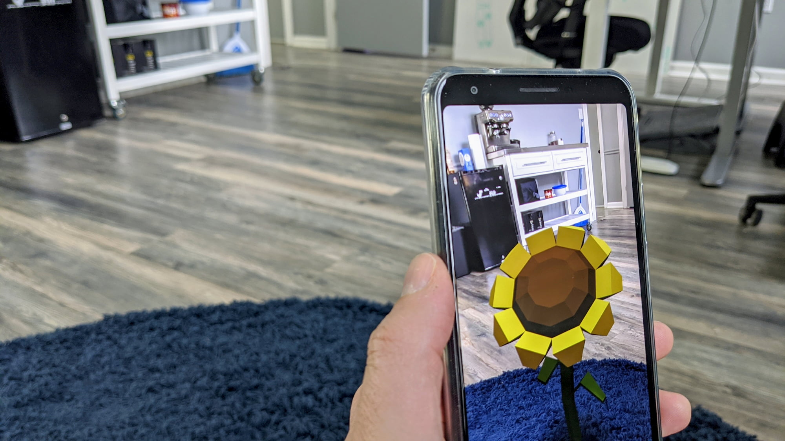

From what I've noticed when I'm teaching, about 90% of phones support WebXR AR module, natively (using a recent Chrome on Android) or [through an app on iOS ](https://fdoganis.github.io/slides/webxr_tips.html#best-alternative-ios-webxr-solutions)(HelloXR, Brrrowser, Mozilla's XRViewer, ArenaXR). 

## Testing Tools

But another crucial platform to support is the desktop, for fast iterations and debugging, thanks to the incredible work by Google on their [Chrome Dev Tools](https://developer.chrome.com/blog/chrome-devtools-mcp), Microsoft on [Playwright](https://github.com/microsoft/playwright), and Meta on their [IWER](https://developers.meta.com/horizon/blog/immersive-web-emulation-runtime-iwer-webxr-meta-quest-developer/) and SEM tools that allow you to test your app in a synthetic AR environment on an emulated Quest headset. Also available as a [Chrome extension](https://chromewebstore.google.com/detail/immersive-web-emulator/cgffilbpcibhmcfbgggfhfolhkfbhmik). Using these tools saved an incredible amount of time from putting an XR headset on and off. 

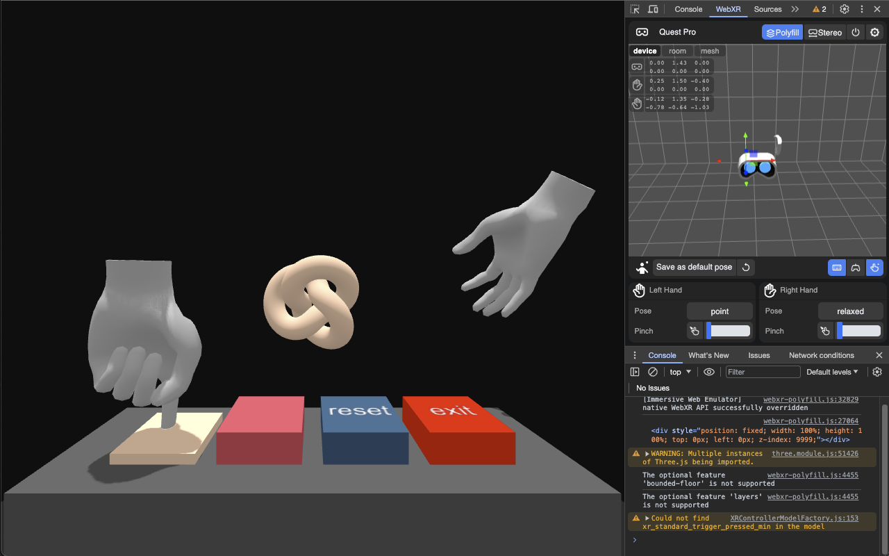

## Fighting the 13K limit

Coding without knowing how large your final bundle will be can be daunting. That's why I added a build size verification check as soon as possible. As the project went on, and as I crossed the limit many times, I realized how naive my initial approach was, and discovered many ways to shrink the code further. I finally understood why so many brilliant JS13K games had such complex build pipelines. Google's Closure Compiler made wonders but also had some trouble with my use of # for private JS members (there's a pre pass to replace these symbols). You can also choose to delete all symbols apart from explicitly defined ones. A bit on the unsafe side but very efficient!

Look at my README, scripts and package.json file and the scripts it uses if you want to get an idea of what is involved. It might not be the most optimal approach but it worked for me so far.

The modular architecture that I used allowed me to swap a component for another. For instance I swapped a boring music generator with the fantastic SoundBox, but needed to degrade the [beautiful fonts that I borrowed from LittleJS](https://github.com/KilledByAPixel/LittleJS/blob/main/src/engineFont.png) with another cheaper text engine.

## The Gamma Engine

After all this design work, I still didn't have a game, just an engine. I named it [Gamma](https://github.com/fdoganis/gamma), for "GAMe Modular Architecture, or just because it's Greek letter thqt sounds the most like "Game". It's the word that I came up with when I needed to create the repo. 

I decided to release it under the MIT license for anyone to use, hopefully saving some time and allowing more people (including my future self) to make more XR games, faster. The repo needs some cleanup, and my coding and design choices might not be suitable for everyone, but I hope it will help someone out there the way that all the tools, libraries and examples have helped me in my journey.

Now let's build the game!

# The game

## States and Levels

The starting process before playing a WebXR game can be tedious: due to security constraints the user needs to **click on a button** before the page is allowed to switch to an immersive mode. The position of the headset at that moment is the default **origin of the virtual world,** which is quite inconvenient. 

From what I have experienced, a simple XR pattern is to let the user define a playing area using a cursor that follows flat surfaces on the real world. This sets the origin of the game. In this case, it places the Gameboard. 

Each of these setup steps (Start, Place, Run) is defined as a State of the Game, for clarity, instead of having a massive if / else  switch for all possible modes. Level definitions are simpler, as they are mostly configured variables to increase difficulty.

## The Gameboard

You might wonder why the Gameboard contains 8 holes arranged as two crosses. I was wondering if I should have just a line of 8, two lines of 4, or a random pattern. 

In order to avoid hand detection issues as much as possible I thought that it would be nice to separate the left and right hands, so that the natural resting position of each hand is above a cluster of four holes, and each hole can be reached with minimal movement. Also, I thought that some people might want to play on a desktop with a Gamepad: one directional cross, 4 front buttons, perfect. 

Oh and that scheme is very close to the one used in [Goemon Fight's whack-a-mole mini game](https://www.youtube.com/watch?v=bbNXmHRZwfU). That's definitely not a coincidence! Actually this is probably the greatest source of inspiration for the game's look and feel. 

  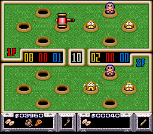

## The holes

Designing holes in AR is far from trivial, so I created one for you, if you ever need to create a game of golf for example. The difficulty comes from the fact that you need to draw a deep hole (not just a disk, here you can peek inside the hole), but that hole should not be visible from the sides.

Imagine a top hat (a magician's hat?), upside down (the hole is upwards). The interior of the hat is an open cylinder (or a closed one where only the back faces are rendered) and the exterior is another cylinder + rim, where only depth is rendered, no color, therefore acting as an occluded of the sides of the hole.

I drew some inspiration from the excellent [examples by Lee Stemkoski](https://stemkoski.github.io/AR-Examples/), but used an external cylinder as the external occluder shell instead of a plane.

  

## AR Shadows

Adding shadows [grounds your virtual world on the real one](https://medium.com/samsung-internet-dev/integrating-augmented-reality-objects-into-the-real-world-with-light-and-shadows-12123e7b1151), it is a very important cue for the eye and brain and must be treated properly. 

  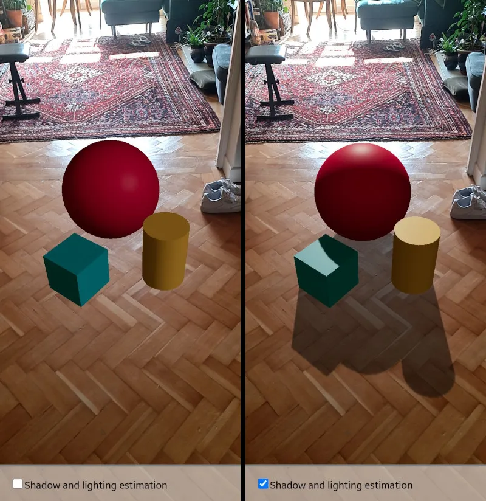

 

Ideally, I should have also used light pose estimation when available, for extra realism.

In *Chromlins*, there is an invisible shadow catching plane, but one difficulty was to avoid the shadow to be cast on the surface on top of the holes. Some stencil magic has been used to solve this issue but there are probably some simpler solutions.

## The theme: Unicorns and Rainbows

One month to create a complete game is definitely challenging, especially when you can only code at night and during the week-ends. That leaves you about at most 8 days to complete everything. 

That's why I tried to identify all year long the components that could be useful for the game. I thought that I could create a standard game and then adjust it once the theme would be announced. I really wanted to create this whack-a-mole game, but when the theme was announced I was caught off guard. How on Earth would I make a game about unicorns and rainbows?

At first I considered having moles that you would have to hit, and unicorns that you would have to save by drawing a rainbow to create a bridge or ladder out of their whole. Or maybe just grab them by their horn to pull them out and back on the rainbow. 

And then I remembered that I needed to **keep things as simple and basic as possible**. Combining many different movements would increase complexity without adding any fun. I needed to focus on taps. 

Before the theme was announced I had in mind that some moles could be holding dynamites, bombs, or mines that should not be tapped. But we should not tap the unicorn, we should save it! Wait, its horn hurts you if you try and tap it! Perfect! Just tap everything apart from the unicorn.

A feature that I wanted to implement is that if you hit a unicorn your hand gets injured and you can no longer use it until the end of the level. But again, I wanted to keep things as simple as possible, so I dropped the idea.

## The characters

For the look of the characters, I was of course inspired by the many retro games of my early years. Pac-Man for the Chromlins, the score and the font, Bubble Bobble, and Final Fantasy's Mog for the look of the Unicorn.

I wanted characters to be as expressive as possible, and tried many crazy ideas but finally just kept **subtle animations for the eyes and the mane**. Most importantly I made the characters look at you: **eye contact in XR makes them feel alive** (as I have experienced in many XR games and experiences).

Regarding the plot, Rainbow Brite was probably an influence, with evil characters stealing the colors of the rainbow. At some point I wanted to render the whole real scene in grey and restore colors progressively. But I did not have the time to test if that would actually look good.

### "Chromlins" ???

So we had these gnomes, goblins, spirits stealing colors. How about some kinds of vampires sucking colors? Or how about just eyes, floating around, and attaching to colors to capture them and bury them under ground? Again the Pac-Man ghosts were surely an inspiration there. 

So what should these color thirsty goblin thieves be called? Chromlins! Like Chroma + Goblins. And it sounds a bit like the mischievous Gremlins. Great!

 Alternative names that I had in mind: "SUTRa: Somewhere Under The Rainbow", or "PAF la Licorne" (as suggested by my wife) but both sounded like private jokes, and the clock was ticking! Hence Chromlins!

### The Unicorn

The unicorn is unique and should be treated with care. It should look great! 

At first it was just a white Chromlin with a pink horn and huge black eyes. It didn't look like a unicorn. 

  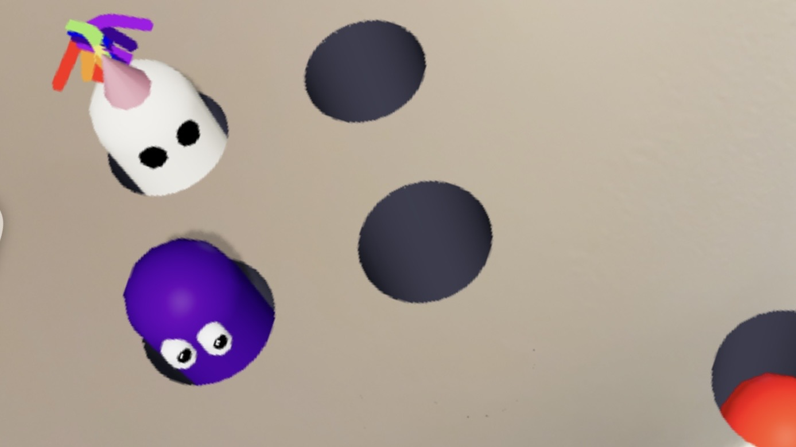

 

So I decided to spend some bytes to define it more carefully. I wanted something minimalistic, ideally as cute as the creatures of the genius artist Karim Maaloul, but I certainly don't have his talent for low poly expressive characters. 

  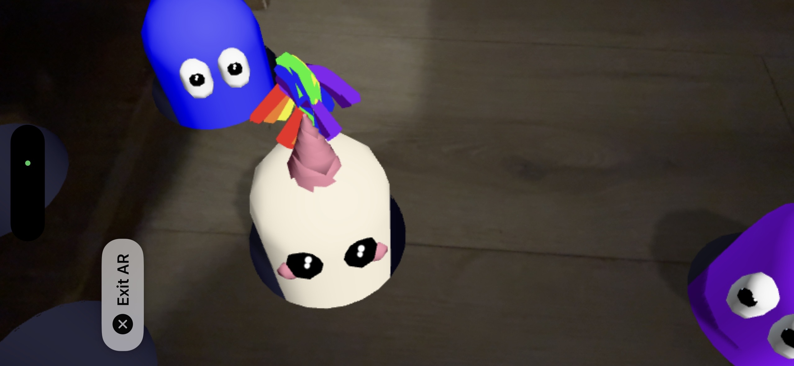

 

I decided to keep the capsule / bowling pin aesthetic, but iterating towards the final design took ages. That's when this dialogue happened, late at night

- *Son*: what are you doing Dad?
- *Me* (proudly): I'm creating a unicorn editor!

  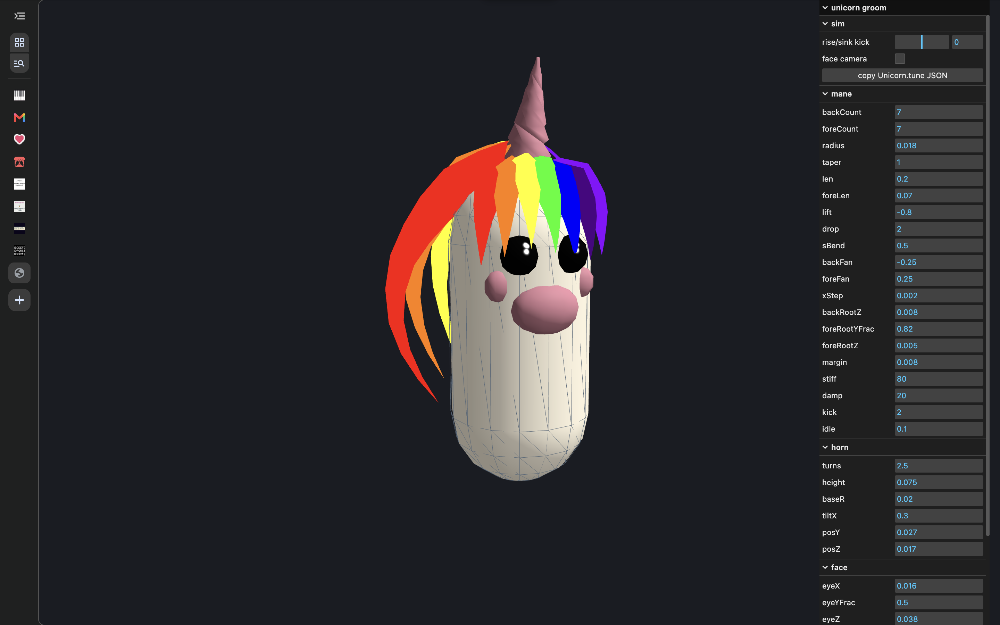

 

  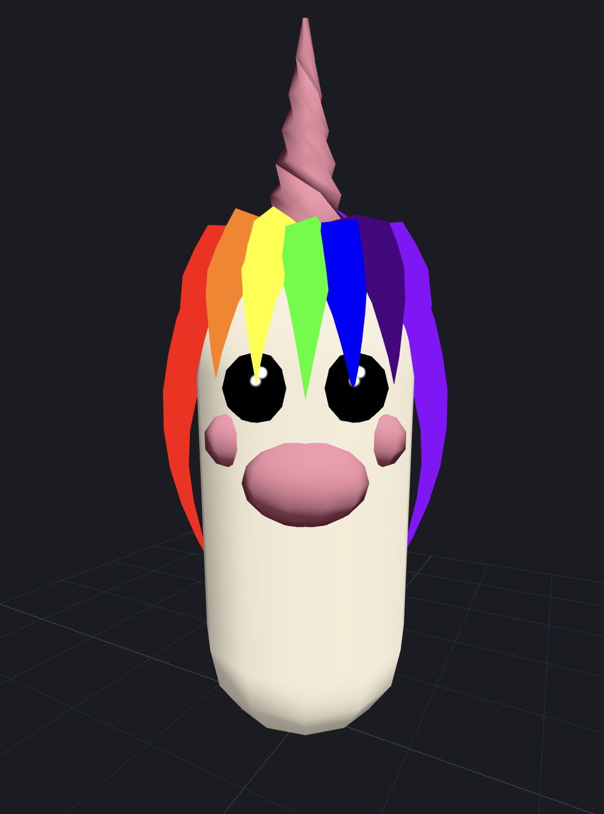

 

My mental health was questioned, but I was truly excited by the idea that I could customize the unicorn to choose the final design, with the mane on the side! 

  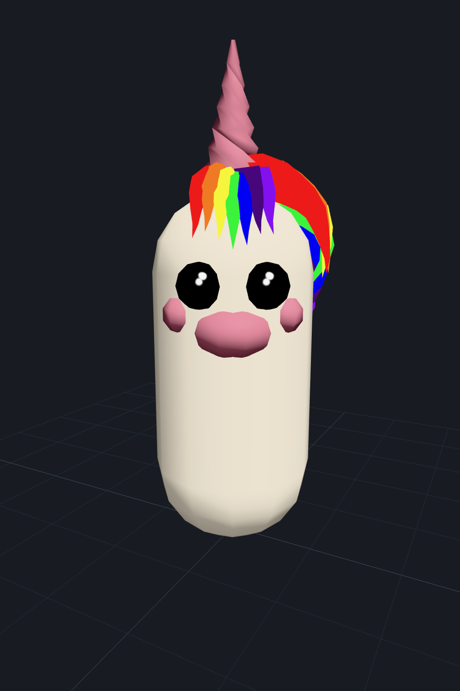

 

And using a url parameter I could test it in-game! And so can you! 

Unfortunately I had to remove this functionality from the official build but I will definitely bring it back. I wanted all players to be able to share their score, name and unicorn.

By the way, there is some code to create the mane and horn by twisting basic THREE.js geometry. 

## The rainbow 

The rainbow is a prominent gameplay element, although it is not a character. Its function is to materialize a game volume, and it also acts like a progress bar! A bit like Apple's Activity Rings maybe?

  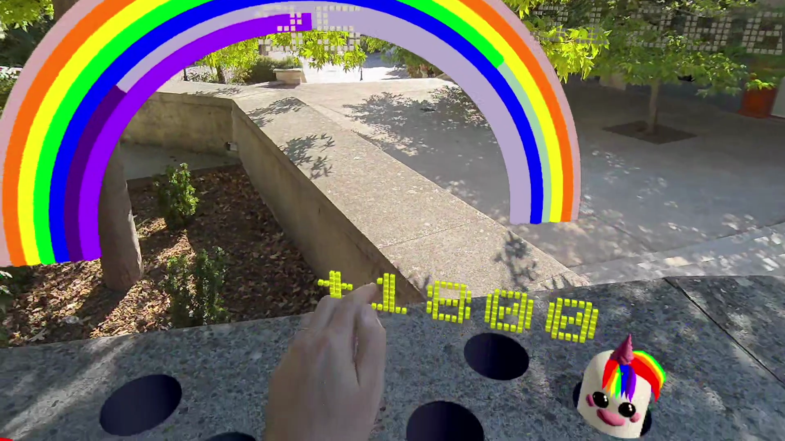

 

On Level 1, every Chromlin you tap restores a full color. 7 taps => rainbow restored.

On Level 2, every Chromlin you tap restores only half of an arc! 14 taps => rainbow restored

The difficulty is therefore progressive and it goes up to Level 7 (+ **a secret level 13**, more on that below!)

## Plot

Something along these lines:

"*A unicorn was happily singing and bouncing on a rainbow.*

*Suddenly, out of nowhere, 8 holes opened in the ground under the rainbow. 7 pairs of eyes came out the holes, jumped onto the rainbow and stole one color each.*

*Without a rainbow to walk on, the unicorn fell in the last hole.*

*The Chromlins, as these color thirsty spirits are called, are now keeping the unicorn underground and nagging you!* 

*Tap them to free the colors, restore the arcs of the rainbow, and let the unicorn return to its home!*"

I started creating a small animation without words to explain this scenario but ran out of bytes.

## Gameplay

You can either smash Chromlins with your palms or aim at them by pinching or hitting a trigger to cast a ray. 

The ray is not visible but you can see its effect, like a bullet. It either hits a target or misses, in which case you see a small amount of white particles on the location of the hit:

  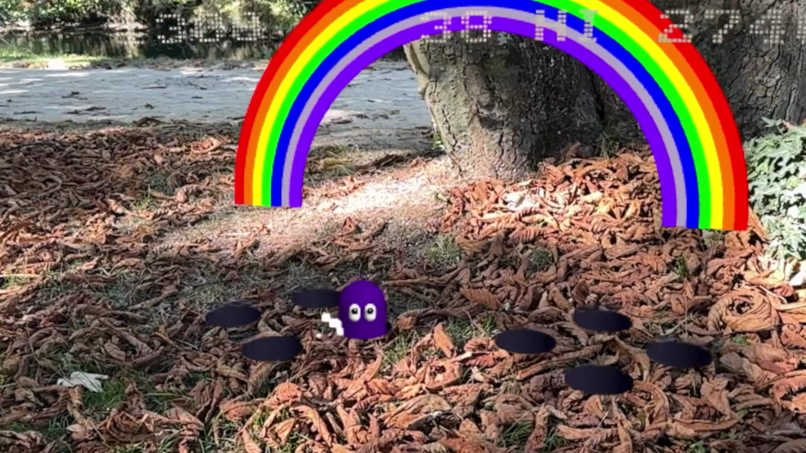

 

But while you can spam rays, indefinitely, you might miss your shot leading to a streak counter reset (during a streak hits increase along the pattern +100, +200, +300 etc. instead of +100 for each hit), or worse you might end up hitting a unicorn, and lose points and color from the rainbow!

I should probably add more juice here with letters like "COMBO" and "STREAK".

Also, the hands should occlude the virtual scene properly. I tried activating depth sensing but the results looked way too pixelated on the Meta Quest 3. I will see if I can create an occluding hand-like geometry that fits in a few bytes.

## Hi Score

Local storage holds the best score.

For the name entry, instead of resorting to a keyboard or another entry system, I decided to reuse as much code and concepts as possible: you simply tap the Chromlin when the letter you want to select appears. 

The Chromlin will change color and the letter will freeze. If you miss the letter you can tap again the Chromlin to relaunch the text animation until you see the letter you want. 

Once you have added your 3 letters, a last Chromlin will appear with "OK" displayed on it. Hit it to confirm your entry!

Secret tip to thank you for reading this far: try entering "13K" as a name and see what happens!

# Text

Typography is beautiful. 
Immersive typography is even prettier.
I wanted text that looks solid, instead of flat panels. But in 13K using a font like the THREE.js ttf loader was not an option.

I thought of many alternatives, including a pretty cool digital stopwatch inspired segmented display. You can find these in the text folder and you can configure the modular Gamma engine to choose the one that suits your game best.

My favorite so far: use LittleJS beautiful pixel font, all caps only to save space, by converting every pixel of each character into a 3D cube. This can be seen in the official trailer, but due to size constraints I had to resort to the cheapest alternative: render the text as a canvas, sample it, and recreate cubes for every pixel. This path still needs optimization (I'd like to precompute a complete PNG file instead of rasterizing from scratch every time I need some text) but it works so far.

I have many other crazy text ideas, I'll see if I can implement them in the future. In any case, adding text to your game is invaluable: it provides guidance, instructions, feedback to the player, it reduces the need to read an instruction manual, and smoothes the onboarding process. It can also be used for debugging, like a fancy immersive console.log()!

Here is a screenshot of a late night debugging session in Brrrowser

  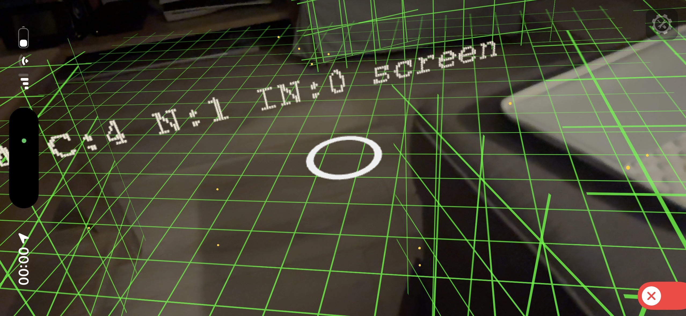

 

# Audio

## Music

I tried creating some music in my Arturia Keystep mk2, a small yet excellent MIDI keyboard which allows to explore musical theme variations thanks to its "mutation" feature.

I came up with some nice tunes, but they were a bit too repetitive. I was wondering how I could create more original melodies.

### The theory

Discussing with a very good friend of mine who happens to be both an engineer and a [musician](https://www.french-metal.com/chroniques/asylumpyre.html), I realized the importance of chord progressions.

I am more of a visual person so a comparison for me would probably be like composing an illustration: finding the right balance between geometrical shapes and colors. 

I learned that there are some popular chord progressions that can't go wrong. But despite the many years that I spent learning music theory during my childhood I still could not come up with a satisfying tune. 

I wanted to see how far AI could help me composing music.

### Finding a "Markdown for music"

I did not want to use Suno or similar services, creating generic music with low effort and little creator control was off the table. Being familiar with music theory, I wanted to generate a proper score that I could modify, tweak, cut easily and rearrange. Yet I wanted something beyond raw MIDI events: I wanted structure. 

So I wondered: what would be the closest equivalent to Markdown for music notation, a format that both humans, computers and LLMs might understand and edit easily? I saw that there was the way too verbose [MusicXML](https://fr.wikipedia.org/wiki/MusicXML), and also [LilyPond](http://lilypondcss.s3-website-us-east-1.amazonaws.com/Documentation/notation/writing-rhythms.fr.html), which seemed powerful but not very intuitive for me . 

Then I discovered and fell in love with [ABC notation](https://en.wikipedia.org/wiki/ABC_notation). To me it really looks like Markdown for music: it gives you a very compact yet readable notation for pitch, duration, voices, bars, patterns, volume, speed, and you can even assign MIDI instruments. The ecosystem is very rich and you can convert an ABC file to MIDI, MP3, WAV or even render it as a beautiful PDF score. I was sold.

I considered using existing Public Domain tunes, but none were sounding like a video game.

### Creating a tune 

I tried experimenting with AI. The tunes generated by default were far from great. They were dull, repetitive. It took a lot of prompting and skill crafting to make AIs produce something original yet good sounding.

I made at least 13 attempts before creating the music for "Chromlins".

I would say that at first, the final tune was a "happy accident", while I was trying create some music for an F Zero / Wipeout racer (and I'm glad I didn't create that game, since the phenomenal Frank Force seems to have coded it for JS13K this year!).

 The goofiness of the resulting music didn't fit at all my original idea SciFi racer idea, but the tune was very engaging so I decided to keep exploring, fixing, guiding, until I was happy with the result.

Is this generative AI? Yes. Is it low effort? Far from it. Is it original, memorable? I believe so, therefore I think it is worth keeping it.

Alternatives would have been to use my less engaging hand-made tune, or to use one of the brilliant sound generators like zzfx-studio and voxby. But I wanted some creative control, and although I do love these generators, they sometimes feel even more low-effort and slot-machine like to use than resorting to AI. 

Of course, I could, and probably should, have made a collab with a real musician, but I wasn't confident enough that I would be able to finish the game in time in the first place. And I don't know many people who would have enjoyed creating such a whacky tune!

[Here it is](https://sb.bitsnbites.eu/?data=U0JveA4C7ZpLaxxHEMf_PbM7imTJer-ID5JNwDfnkmNOISGXnAI5RAEfDDYOsmxZj8gKsjtC7GZtS2xWkRYtQkE2dow_QXJKECGfwOCv4W9gV79Wu6MYhOiScajfUFMzveI_PdU9XVO7-ucs8BH6OtTfGuqv-U4gGzkP4vNUqdHfMfFVNp6Zc5WoVCWFYtbxQWfXme7OnrO9fT39A52DQ4PDg0Mjo2PjddSwhTr9bcPu47Nrlc01agzqv9j-11DFBh4w6DfIdshMbLYY7oAn5kf1G0z6O81R5iHo_sakv8cc_9Dvx0z6j7x_wqT_xF9jj2mMXVz2aeMZi30_yntMz8Cu7_c-0xg_JXtG9pz1-WrY2HCsRVtet8E0f-rWGj7HxF-fTV6p2hxTZclf-9Yes60P7fkrPjUbI2Cd7D7L-B5m9wpK0fU53hkEQRCOxZQGLutuoBtf-qbkNTDxdbpaMCe5Es5UcH1kxf6B_sH-gaHhkVGzhLllzO03vIV9zVvYbyGkguMmhFZ15NSRU8eJ1B-06G-03YMp8VyKqfrzX1vsuPoVsjJZyeuut7SHFBbaTb83W9qPFx3kooNcdE5Oma6wQSqbNgmWo8_ACt11ldTNK866jUhc7nv9basf_yXBRcd9wcDxJcBD2_s6vUZt0tHD6PohOk5_Pbp-yY9AzUa_xKjPNb5lGtdy08ePf4V6Xmn62Jg5WbOz1Pn48XHPANcr8hpWyUqkvcagHvJRne2rsPx6H3_-mxgBP5HdZdB3o2pG4R5WsBxd_17ufPU_7k8QBEE4SnqgkfyrMyrhuidNw6cFldz4pmPiVvpZ4so3RS3NCi6UcNlhCTdnF-E52haxxLDEH-rPYgbT0fVv4kdSXsFtlgRoen6D9qbf39MxWOJj-m_uY4Yl_ryYfi-SBR8bE5slsuBjY-bNElnwHOO7TBZ8bOahKfa66WOzQC-XN8mCj42Z8wtkwcefn-1b_PnZvsWfP-0bx_pg1v5Fv0LHZprWzWnSnbX7-Mxam2Nb5xbtM-DiNMugPwOXXa6TXWXQd4XbEtv4XoMgCIJwIi7d6UFpVeEK8N0fKVAAkvIVNQUoKKWSlIy8KhDkimmagqxIx-ZzZM2XPs3UQ31KkWDrP9Hq2fSZ7iDo6lMbCUEQBEEQBEEQ3srHugulcmpKuG__9G1rlzFlvHLlG1kaSrjQhmAGnbPYcGqjRZdL_7SuIQiCIAiCIAjC_56Dn8-rMZ1NzhSTL15B4YJCMv_ywx9gK7jDEs5T8G3hV7gstSraq2mmXuqmaSZ93eaj63P_Usb0C1_QbiIPjCAIgiAIgiC8Y3RXYuqKF8XeT865FrUNXAwfq9yf-1IuoUNXvSl9mp1lKIE05J8EBUEQBEEQBEF4P3gD) in all its glory.

## SFX

Soundbox is great for music, but for SFX every sound effect is actually a small music track. While in the past I played a lot with Zzfx designer to create sounds, I couldn't find an equivalent tool for SoundBox so I built one (or rather Claude did!).

Exploring sounds can be very time consuming and I was running out of time and space. It's definitely something that I should push further, especially now that my latest build system manages to save more bytes!

# GFX

Here are a few things I used which might be interesting to you:

- easing and particles: these are quite standard minimal implementations, inspired by Karim Maaloul's work, among others.

-  instancing: drastically reduced draw calls. For particles and text, rendering 1M cubes is as fast as rendering just a single cube. You lose some flexibility, yet you can still apply a different color and matrix to each individual cube.

- Scratch variables: never create new JavaScript objects 60 times per second! Yes, it works, but it ruins performance. Using scratch (temp) variables is a THREE.js common practice to keep a smooth frame rate by avoiding JavaScript's Garbage Collector from spiking.

There are still many things that could be optimized further: making the code leaner, lighter and faster is a never ending process.

## Rumble

I managed to fix a last-minute bug so now my code works on more mobile devices, including the fantastic [Brrrowser](https://apps.apple.com/fr/app/brrrowser/id6747417026) which exposes haptic feedback to JavaScript code! 

You will feel some vibrations every time you hit a Chromlin! Install the app and paste the game URL to try it out.

 

# Coding in the age of AI

**DISCLAIMER**: What follows was initially supposed to be a disclaimer on my usage of AI in this jam, but ended up more like a rant or even a dump of my personal thoughs about AI at the time of writing. Feel free to skip this section if you are fed up with reading stuff about AI. Go out and take *Chromlins* with you, enjoy life, touch grass, have fun!

## AI: a necessary evil?

AI is the elephant in the room. 
It is everywhere, to a point that it has become almos tunavoidable.

There are many understandable fears related to AI. People fear that AI will make them lose their jobs, ruin the environment and that it will eventually destroy humanity. All this fear is very understandable and some of these dangers are plausible.

What is certain, and also worrying, yet to a lesser extent, is that AI has absorbed all human knowledge without consent, without proper credit, without retribution. People are talking about massive IP laundering, or even IP theft. I therefore have mixed feelings about this technology. I would love to have a green, frugal, powerful and local AI, sandboxed, tuned to my needs, and trained only on clean data. Yet here we are.

AI is definitely a revolution for software development, akin to the industrial revolution for manufactured goods or the massive introduction of cheap plastic packaging. We see that despite all the benefits of this novel material, we are now dealing with plastic pollution, and we can't go back, just the way AI has polluted the internet with slop.

AI is an extremely powerful tool which can be used for both good (drug discovery) and evil (bio weapon design) and should therefore be handled with care. Let's put aside all the AI induced anxiety and let's focus back on the question of creativity.

## A creativity booster?

This project started as a fork of my WebXR js13k repo: [three_vite_xr_ts](https://github.com/fdoganis/three_vite_xr_ts). If you are against the use of AI and consider that coding games should be an entirely "manual craft", feel free to use that repo as a starting point instead of the full fledged Gamma engine.

Personally I am still trying to figure out how AI should and should not be used in the context of software development and creativity. And I would like to share my journey with AI as a developer and creative coder.

I believe that low-effort AI / mindless slop generation should be avoided. However creative iterations, explorations and discovery, and of course learning with AI should not be dismissed. If you consider AI as a co-worker, as a virtual member of your team, or, more abstractly, as a super compiler and search engine with a human-like UX, to push your personal ideas faster and further, I think it does wonders to productivity and it opens a door to many new possibilities.

## New Horizons 

Here are a few paradigm shifts enabled by AI:

- bug-free code: just like grammar mistakes seem to have disappeared from most LinkedIn posts, code now compiles and passes tests from the start

- more relaxing iterations: even if the code is able to run without errors, if the result is not what you expect you know that you should be able to get there eventually, in a matter of hours, not days

- helping you in domains that you don't master: I love designing art manually, as well as writing (this whole post is 100% AI-free!), and I wish I were a great music composer, which I am not (yet?). I do know music theory and I believe that sampling, like collage, and curation is a form of art and an expression of taste. AI helped me a lot in exploring new musical ideas.

Keep in minf that AI can lead to uniformity, dullness, generic art and mediocre code. There are no outliers here, if you want original ideas you have to push the AI further, and get it out of its comfort zone and over confident tone. 
 
## The end of developers?

After many years of software engineering and coding, I remember the early pre WWW days where you would code inside an equivalent of Notepad, with no auto-completion, formatting, and no error checking. Yes, I am that old.

 You would launch the compiler from the command line and hope that it would catch your mistakes. Producing correct code was difficult, and your main reference was examples in books, or magazines with CDs (remember those?). Some would say BBS. I personally always preferred a good old book (and still like them!).

As the web expanded, coding examples could be found online. You no longer had to copy lines by hand like some pre Gutenberg era monk but could find bits or code or entire libraries that you could reuse, with the author's permission in exchange of  proper credit. 

Then as sites like StackOverflow grew in popularity, you were almost assured to find the answer to your common questions by checking the highest rated comments. Of course it still required a lot of judgment to see if the most voted answer was actually correct (spoiler: that's not always the case!) and if it would work in your specific case, but such sites did turn most software developers as people handling existing software bricks and gluing them together as consistently as possible.

Now that AI is able to search for bricks and glue them together for you, what's left? Well, direction, structure, domain knowledge. As confident as an AI might sound, you are the one with the project vision, you can make it follow your rules, architecture, style, and taste. And your expertise is required when the AI gets stuck.

Examples: when creating the virtual hole, Claude (Sonnet 5 Extra, my current default) insisted on drawing the occluded using BackSide rendering. I knew it was wrong and after trying to convince the LLM that I was right, I modified the code myself, checked the result and told it to accept it with no further discussion.

Another example: while I was trying to automate the whole code / run / test inside a simulator, Claude told me that it was impossible to test the code without a headset. I had to give it the URL of Meta's IWER as well as a direct link to the API exposed via MCP, to convince it that it was feasible.

The rest is history: my engine has many automated tests that I would never have taken the time to design, but which were the most precious investment in terms of iterative design. 

## Loop engineering
People are talking about **loop engineering**, this is an example of how you get there: design a system that can iterate autonomously by allowing to check automatically the result of any modification. No more AIs telling you: "run this code and let me know if works". I don't want to be a passive QA tester for AI slop. AI should be able to produce the best possible code given my design and specs. And it should be able to build metrics to test code validity if you haven't provided any, in order to close the loop.

Beyond helping creating impressive build pipelines and testing rigs, AIs also excel at creating powerful tools like editors and debuggers. That's how I "vibe coded" (can't think of a better term here given the very low supervision and constraints involved in this specific case) tools like the unicorn editor, or the sound designer. They allow me to tweak parameters and explore design. They could have been coded in whatever language, have many dependencies, weigh megabytes of code, the result mattered most than the tool. I hope that you might find them useful. 

These are more throwaway tools that just need to do the job, whatever the architecture. If you are mostly interested by the outcome you don't need to control the code as closely as you do for a game that fits in 13KB.

# The End

Thanks for reading this way too long post! I hope that showing some glimpses of what happened behind the scenes during the development of this game will help you for your future creations!